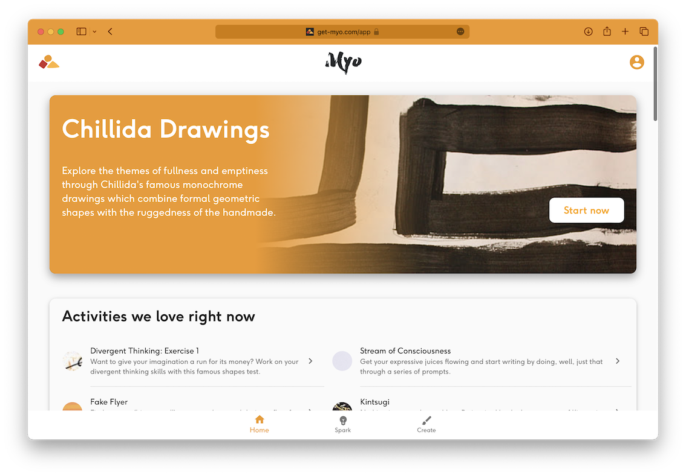

# Myo - AI powered creativity tutor

## The big idea - Spark wonder

Myo is a web-based creativity tutor.

> Every child is an artist. The problem is how to remain one once we grow up - Picasso

## Repository contents

This repository contains a React frontend in `src/` and a Flask API in `api/`

### Installation

1. Clone the repository.
2. Inside the root directory of the repository, run `yarn install` to install JavaScript dependencies.
3. To start a React dev server, type `yarn start`
4. To develop the Flask API, change directory to `api/`
5. Install Python Flask dependencies using `poetry install`

## Screenshots

